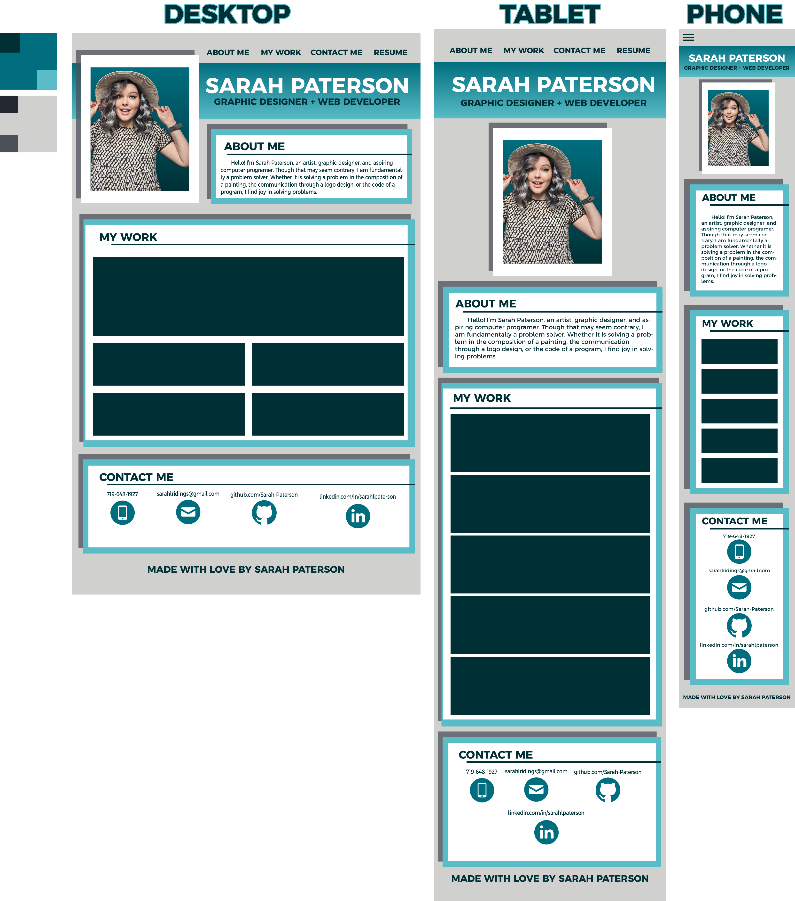
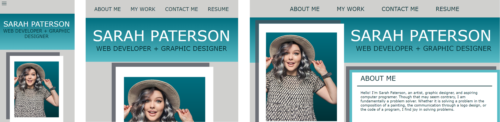
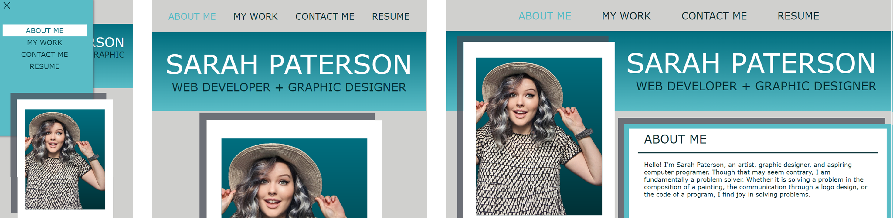
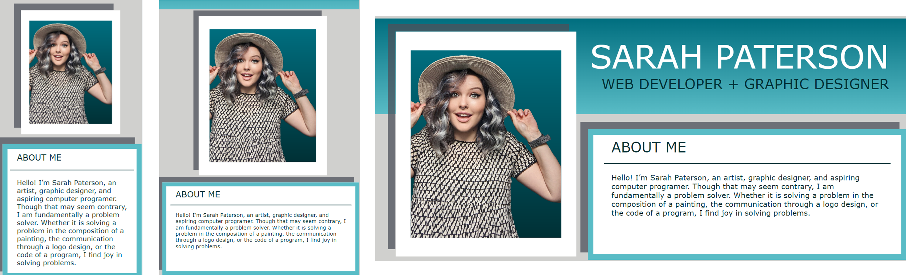
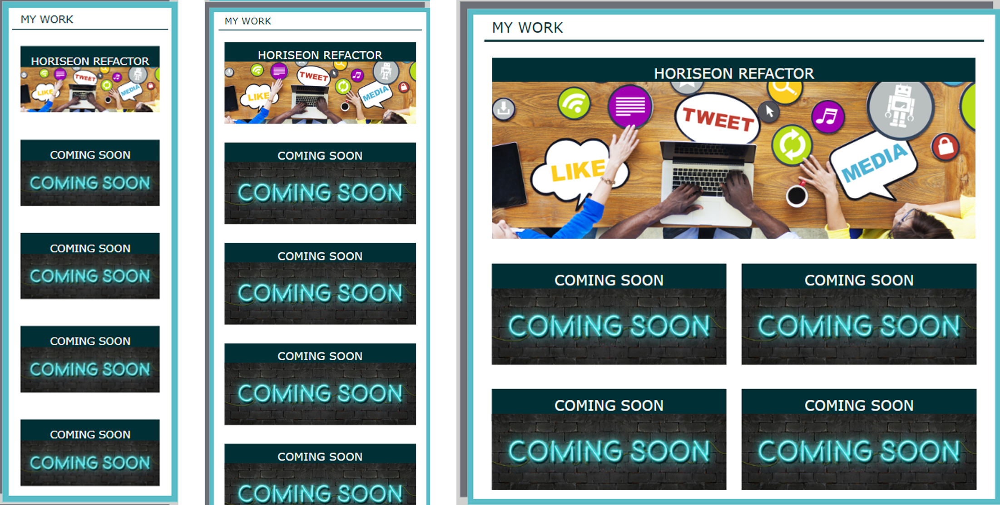
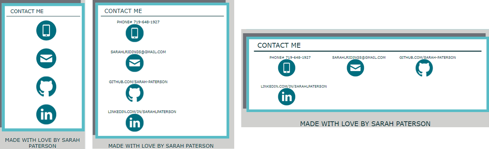

# Sarah Paterson Portfolio

## What this portfolio is all about

This website, built with only HTML and CSS, is designed to provide a single landing page providing future employers information about me, examples of my work, a way to contact me, and a resume ready to be downloaded.

My motivation was to have all my professional qualities and contact information in a single, visually appealing, and easy to use space. So, I built this project to centralize that information and give future employers ease of access to my information.

Through the process, I mostly learned about scaling and media inquiries. My biggest challenge was to shift my thinking from a single stagnant design that remains one size to creating a design that would work on many different scales. Though there is plenty of room to grow, I believe I was able to achieve a scalable, visually appealing, user friendly webpage.

[Here is a link to my live website](https://sarah-paterson.github.io/Sarah-Portfolio/)

## Table of Contents

- [Design](#design)
- [Usage](#usage)
- [Credits](#credits)
- [License](#license)

## Design

Because of my design background, the most logical place to start was at page design. My intention was to create a wireframe that included color, photos, and scaling. This way I could have something to aspire to create.

Below is the wireframe I based my webpage on (made with Adobe Illustrator).

From here, I could use my Illustrator file to determine sizing and color. Though the final page doesn’t look exactly like my initial mockup, I was able to create something very similar.

## Usage

Below are screenshots of elements on my live webpage. Please use [this link](https://sarah-paterson.github.io/Sarah-Portfolio/) to see the webpage yourself.

Navigational Bar.

Here is a comparison of the three navigational bars from the scale of a phone, tablet, and monitor. As you can tell, the phone navigation bar is only three lines, otherwise known as a hamburger menu. Below you can see what would happen in the phone if you were to click on the menu, and it also shows how the text changes when hovering over the items in the navigation menu for all three sizes.

Additionally, the spacing changes from desktop to laptop and phone. Below you are able to see how the profile picture and About Me section moved to better accommodate a smaller screen.

The other change in scaling is how the projects are displayed under the My Work section. As shown in these screenshots, the desktop view has the items laid out with one larger than the others while the tablet and phone sizes have the projects stacked. Each project is linked for ease of access.

Finally, the Contact Me section changes slightly depending on the size. Each item is linked to make communicating with me easier.

## Credits

For this project, I used many resources to walk me through the process as well as some code from online sources. Please check out the original sources to discover more from those creators.

The adaptive hamburger menu (CSS only) came from this webpage article:
https://alvarotrigo.com/blog/hamburger-menu-css/
The code for the adaptive hamburger menu (CSS only) came directly from webpage:
https://codepen.io/alvarotrigo/pen/yLzaPVJ
Álvaro (@alvarotrigo), is the creator of the adaptive hamburger menu (CSS only). Their profile:
https://codepen.io/alvarotrigo

My reset.css was provided by Alligator.io via this webpage:
https://www.digitalocean.com/community/tutorials/css-minimal-css-reset

I was also assisted by a tutor to problem solve some of the issues I dealt with.
Collin Porter: cporter@bootcampspot.com

I used many references from the University of Denver’s GitLab course material (DU-VIRT-FSF-PT-04-2023-U-LOLC) throughout my project. 
The Coding Bootcamp github: https://github.com/coding-boot-camp

A helpful resource I used for most of my questions was W3 School’s information on HTML: https://www.w3schools.com/html/default.asp
And W3 School’s information on CSS: https://www.w3schools.com/css/default.asp

The README template I used was provided by The Full-Stack Blog: https://coding-boot-camp.github.io/full-stack/github/professional-readme-guide

## License
MIT Licence

